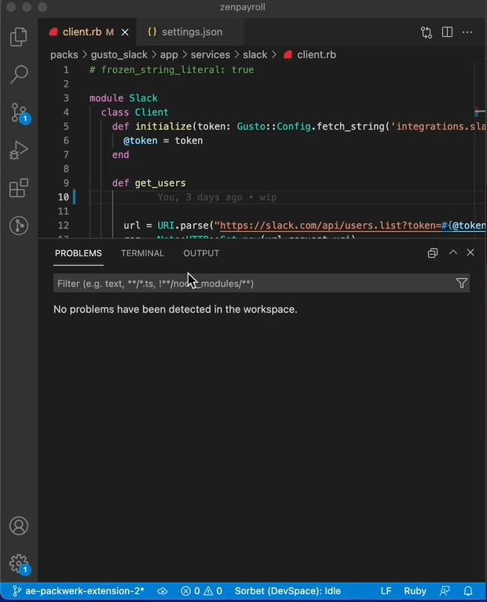

# Packwerk for Visual Studio Code

This extension provides an interface to packwerk for vscode.

[packwerk](https://github.com/Shopify/packwerk/) helps modularize large Rails monoliths

TODO [packwerk-vscode in Code Market Place](https://marketplace.visualstudio.com/items/TODO)



## Features
- auto invoke when saving/opening a file

## Future Features
- automatically update deprecated references
  - possibly allow for updating a single file rather than a pack
- click to open public API where constant lives

## Stability

This is version 0.0.1. This is an alpha extension that is not guaranteed to work. We encourage you to experiment with it and provide feedback!

## Configuration

Specify configuration (via navigating to `File > Preferences > Workspace Settings` and editing file `settings.json):`

```javascript
{
  // If not specified, uses `bin/packwerk` (default and recommended, as this is what the packwerk setup guide recommends for executing packwerk)
  // You may want to change this if, for example, you have a remote development environment that executes packwerk in a remote box.
  "ruby.packwerk.exectable": "",

  // default true
  "ruby.packwerk.onSave": true
}
```

# todo

- testing & CI support

# Contribute with this extension

Please install packages with yarn.

    yarn install

You could install TSLint extension for .ts files.

Please format code using prettier.

```
yarn prettier src/* test/* --write
```

# License

This software is released under the MIT License, see [LICENSE.txt](LICENSE.txt).

# Kudos

Thanks to https://github.com/misogi/vscode-ruby-rubocop which this was modeled off of.
